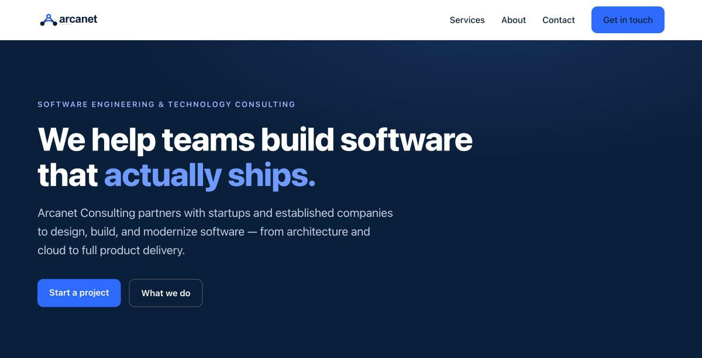
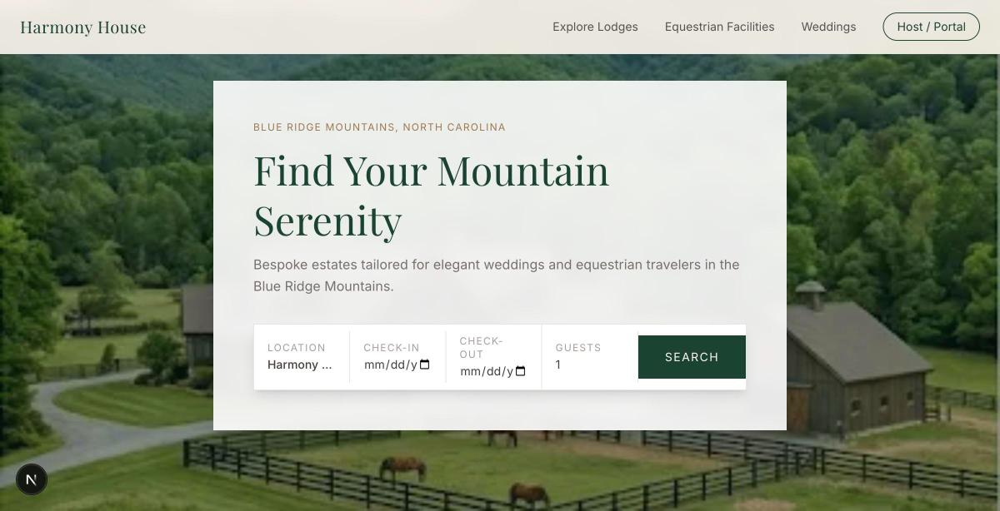
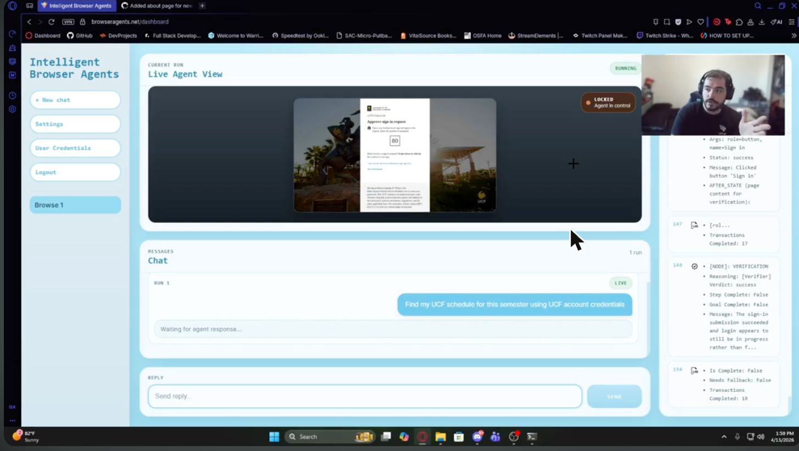

# Hi, I'm Caleb 👋  
### Full-Stack Developer | Founder @ Arcanet Consulting | Product-Focused Builder

 

---

## 🚀 About Me

- 💻 I build software across **frontend, backend, and systems-level projects**
- 🏢 Founder of **[Arcanet Consulting](https://arcanettechnology.com)** — hands-on engineering help for startups and small teams, from architecture to shipping
- 🤖 I’m especially interested in **autonomous/intelligent browser workflows**
- 🎯 Current focus: **shipping impactful projects and improving software craftsmanship**

---

## 🧰 Tech Stack

### Languages

### Frameworks & Runtime

### Cloud, Deployment & Data

### Tools

---

## 🌟 Featured Projects

### 🏢 Arcanet Consulting
**Site:** [arcanettechnology.com](https://arcanettechnology.com)

My software engineering & technology consulting practice. I work directly with founders and small teams — hands-on, no hand-offs — to design, build, and modernize software, from architecture and cloud setup through shipping the actual product. The pitch is how I work: direct, honest scoping, and shipping without cutting the corners that come back later.

- **Custom software** — web apps, APIs, and internal tools built to be maintainable
- **Cloud & infrastructure** — architecture, migrations, and CI/CD on AWS, GCP, Azure, and Cloudflare
- **Technical strategy** — system design, code and architecture reviews, and honest build-vs-buy advice
- **Product delivery** — scoping, prioritizing, and shipping from MVP to launch

**Engagements:** project-based or ongoing · work directly with the person doing the work

---

### 🏠 Harmony House NC
**Repo:** `Caleby03/HarmonyHouseWebapp` *(private)*

A direct-booking and calendar-sync platform for **Harmony House NC**, a short-term rental in the Blue Ridge Mountains of North Carolina catering to wedding parties and equestrian guests. Guests book directly on the property's own site instead of paying platform fees on Airbnb or Vrbo.

- **Live availability calendar** with direct date selection and instant booking
- **Square** Web Payments for checkout; **Resend** for confirmation and cancellation emails
- **Automatic calendar sync** — a **GitHub Actions** cron ingests Airbnb & Vrbo iCal feeds every 15 minutes so availability is always accurate
- **Host portal** (`/portal`): reservation list, platform-color-coded calendar, revenue & occupancy metrics, property editor, and date blocking

**Stack:** Next.js 16 · React 19 · Tailwind v4 · FastAPI · SQLModel · PostgreSQL · Square · Resend · Railway

---

### 🤖 Intelligent Browser Agents
**Repo:** [Caleby03/Intelligent-Browser-Agents](https://github.com/Caleby03/Intelligent-Browser-Agents) · UCF Senior Design (Team L07)

A platform that turns natural-language instructions into real actions performed on a live browser session. Users delegate repetitive digital chores — filling forms, navigating dashboards, downloading files — to an agent that reads the page, plans, and executes visually and safely, with the whole run streamed back to the UI in real time.

- **LLM-driven agent runtime** built on **LangGraph** — an orchestrator → executor → verifier → fallback/interaction loop
- **Playwright** browser automation with ARIA-oriented DOM extraction and a modular action layer (navigate, click, type, search, scroll, press_key, wait, extract_content)
- **Human-in-the-loop (HITL):** the agent pauses to ask for clarifications, approvals, or credentials mid-run
- Live browser frames, logs, and agent reasoning streamed to the frontend over **WebSockets**
- Full account system + encrypted storage of reusable credentials and profile data for automation contexts

**Stack:** React + Vite · FastAPI · LangGraph · Playwright · PostgreSQL · WebSockets · AWS (LightSail/EC2)

**Demo Video:** [Watch on YouTube](https://youtu.be/CmKoODnEdDQ?si=L1nCML-f8zLrPcDL) · **Showcase:** [UCF Senior Design page](https://www.cecs.ucf.edu/SeniorDesignShowcase/team/intelligent-browser-agents/)

---

## 📊 GitHub Analytics

 

---

## 🔎 Live Profile Details

  

